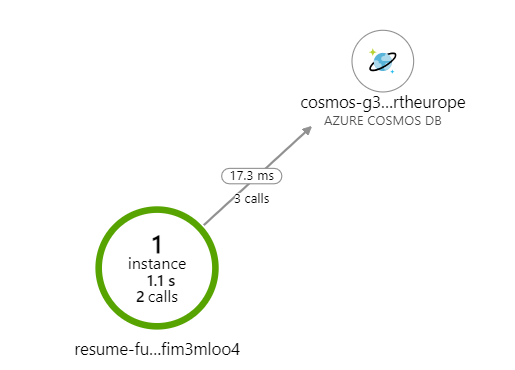

[](https://github.com/salem84/azure-resume-challenge/actions/workflows/ci.yml)

# Azure Resume Challenge
#### 'A Cloud Guru' challenge

Hi guys 👋👋👋

this is the repository for my first [A Cloud Guru Challenge](https://acloudguru.com/blog/engineering/cloudguruchallenge-your-resume-in-azure) to create a web resume using Azure infrastructure!

The site url is [www.giorgiolasala.space](https://www.giorgiolasala.space).

Thanks to [Amen.pt](https://www.amen.pt/) for the free domain 🙏 used in this challenge!

## Infrastructure as Code
In order to manage Azure infrastructure resources, I have used a template based on Bicep, that provides a transparent abstraction of Azure Resource Manager (ARM) template.

In our specific use-case:


Bicep template is composed of following resources:
* _CosmosDb_ (Account, database, container)
* _Storage Account_ 
* _Function_ with Consumption Plan
* _Application Insights_

A Bicep template could be easily deployed to an Azure Resource Group using Azure CLI 

```
az deployment group create --resource-group AZURE_RESOURCEGROUP_NAME --template-file BICEP_TEMPLATE
```

Unfortunately some configuration cannot be directly applied from Bicep/ARM deployment template, such as Static Website configuration.
But... 🚀 GitHub Workflows are the rescue!

Moreover in order to create workflows completely indipendent from specific resource names, I have exported some output variables from Bicep template itself to be used directly in GitHub Workflow.

Indeed, at the begininnig of Bicep template, resource names are "randomized", generating a deterministic unique string based on Resource Group name:

```
param appName string = uniqueString(resourceGroup().id)
```

and at the end of file, there are all exported values used during deployment phase; in particular I have:
* _StorageAccountName_ to deploy resume static files after NuxtJs build
* _FunctionUrl_ to deploy Azure Function
* _Cdn_ information to purge after deployment

### Azure Deployment button
During creation of Bicep template, I have learned that Azure Button can be attached only to ARM templates. Maybe this issue will be solved in the future (Bicep templates are quite young :) ), but in the meantime I have created a [CI build](.github/workflows/bicep.yml) that generates automatically ARM template and a 🤖 GitHub Bot user commits JSON file directly into the repository.

Finally, it's possible to link Json ARM file to a Deployment button such as:

[](https://portal.azure.com/#create/Microsoft.Template/uri/https%3A%2F%2Fraw.githubusercontent.com%2Fsalem84%2Fazure-resume-challenge%2Fmaster%2Fdeploy%2Fmain.json)

This button isn't necessary for Azure Resume challenge project, but however I would like sharing this 'pork-around' 🐷!

## GitHub Workflow
Under _workflows_ folder there are 3 pipelines:
a) [_bicep.yml_](.github/workflows/bicep.yml)
b) [_ci.yml_](.github/workflows/bicep.yml)
c) [_build_deploy.yml_](.github/workflows/bicep.yml)

### bicep.yml 


### ci.yml

### build_deploy.yml
This workflow is composed of three jobs (splitted in two phases)

<IMAGE_GH>

- Azure Infrastructure
    1) Deploy Azure Template job
- Azure Code
    2) Azure Function job
    3) Nuxt job


## Azure Function
Azure Function is developed in C# using _CosmosDb_ bindings to write a simple record and tracking visitor.
In particular I have used two bindings (maybe uesd only one of these?):
* _IAsyncCollector<CounterStatsItem>_ : to create a new document
* _DocumentClient_ : to count all visitors in CosmosDb container

Moreover I have attached _Application Insights_ for logging and monitoring:



## Resume Template

Resume template is based on beautiful resume NuxtJs code developed by [Ivan Greve](https://github.com/ivangreve/nuxt-resume) and [StartBootstrap Theme](https://github.com/startbootstrap/startbootstrap-resume/).
I have developed a custom Vue component ([source](resume/components/Counter.vue)) in order to do an HTTP request to Azure Function.

## Conclusion

### What are your biggest takeaways
This challenge was the opportunity to start with new technologies and to go deeper with others.
It was the first time I have used Bicep template and NuxtJs framework, two very interesting technologies and at the same time I have played with CDN and Azure Static WebSite!

As regards Bicep templates, in the past I have used different IaC frameworks, but this time I was surprised to see Microsoft documentation (for each ARM code in Microsoft site there is the equivalent Bicep template) and to find many examples on this [GitHub repository](https://github.com/Azure/bicep/tree/main/docs/examples).

Instead as regards NuxtJs, I have learned only some basic concept and I would like to broaden my knowledge about it.

Surely the most important "lesson learned" was the opportunity to orchestrate all these technologies using GitHub workflows!

### What was the hardest part?
During development of all services I have encountered some challenging parts:
* _Testing GitHub pipeline_: to be sure it works correctly, all changes must be committed; I have read about [Act](https://github.com/nektos/act) project, but I haven't success to start it locally... surely I will investigate about this choice.
* _CDN and domain configuration_: I have never used CDN, so I have found some issues to check if it's correctly works (why obtain 404 response?). Also CDN TLS configuration is quite confused to troubleshoot.

### Thanks


All users in Discord "A Cloud Guru" channel for suggestion and ideas!

